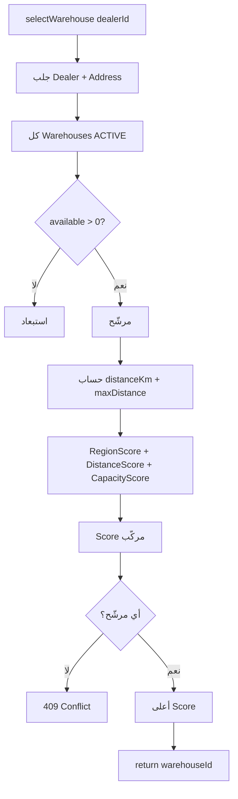

# WMS — خوارزمية توجيه الوكيل إلى المستودع (Warehouse Routing)

> **الغرض:** وثيقة مرجعية للمشروع وملف SRS — تشرح **ما** تفعله خوارزمية التوجيه، **كيف** تحسب الاختيار، و**أين** تُستدعى في النظام.  
> **الحالة:** مُنفَّذة (R0–R3)  
> **التاريخ:** 2026-07-27  
> **التنفيذ:** `CompositeScoreRoutingStrategy` · `JpaWarehouseGateway` · `DealerWarehouseRoutingService`  
> **مرتبط بـ:** [WMS_AUTO_WAREHOUSE_ROUTING_PLAN.md](./WMS_AUTO_WAREHOUSE_ROUTING_PLAN.md) · [wms-gateway-contract.md](./wms-gateway-contract.md)

---

## 1) نطاق الوظيفة (Scope)

### 1.1 المشكلة

عند إنشاء طلب شحن (Pickup أو Delivery) يجب ربط الوكيل (Dealer) بمستودع WMS واحد **رئيسي** (Primary Warehouse) يستقبل أو يُرسل منه الإطارات. التوجيه يجب أن يكون:

- **تلقائياً** — بدون تدخل يدوي في المسار السعيد (happy path).
- **قابلاً للتجاوز** — System Admin يقدر يثبّت مستودعاً يدوياً عند الحاجة.
- **مستقراً** — بعد أول اختيار، يُعاد استخدام نفس المستودع لكل الطلبات اللاحقة (ما لم يُغيَّر override).

### 1.2 خارج النطاق (Out of Scope)

- اختيار مستودع **لكل طلب** على حدة (النموذج الحالي: مستودع رئيسي واحد per dealer).
- مسافة طريق فعلية (OSRM/Google) — MVP يستخدم Haversine على مستوى المدينة.
- إعادة حساب تلقائي دوري عند تغيّر السعة أو العنوان (مرحلة لاحقة).
- جدولة أيام الاستلام/الإرسال من `WarehouseSchedule` — حالياً أيام افتراضية ثابتة في `JpaWarehouseGateway`.

---

## 2) متطلبات وظيفية (SRS — Functional Requirements)

| ID | المتطلب | الأولوية | الحالة |
|----|---------|----------|--------|
| **WR-01** | النظام يُعيّن لكل وكيل مستودعاً رئيسياً واحداً (`is_primary=true`) في `wms.dealer_warehouse_assignment`. | Must | ✅ |
| **WR-02** | عند أول طلب يحتاج مستودعاً ولا يوجد primary، يُشغَّل محرك التوجيه تلقائياً ويُخزَّن الناتج. | Must | ✅ |
| **WR-03** | إن وُجد primary (تلقائي أو يدوي)، تُعاد نفس النتيجة **بدون** إعادة حساب. | Must | ✅ |
| **WR-04** | تُستبعد المستودعات غير `ACTIVE` من المرشحين. | Must | ✅ |
| **WR-05** | تُستبعد المستودعات بدون مواقع تخزين متاحة (`AVAILABLE` + `is_occupied=false`). | Must | ✅ |
| **WR-06** | إن لم يبقَ أي مستودع مرشّح، يُرفض التوجيه برسالة واضحة (409 Conflict). | Must | ✅ |
| **WR-07** | التقييم مركّب: منطقة جغرافية + مسافة + سعة، بأوزان ثابتة (§4). | Must | ✅ |
| **WR-08** | System Admin يقدر يقرأ / يثبّت / يمسح primary عبر REST (§7). | Must | ✅ |
| **WR-09** | مسح primary يُعيد تفعيل التوجيه التلقائي عند الطلب التالي. | Must | ✅ |
| **WR-10** | موقع الوكيل يُؤخذ من `dealer.address` (منسوخ من Lead عند الإنشاء — V28). | Must | ✅ |

---

## 3) متطلبات غير وظيفية (SRS — Non-Functional)

| ID | المتطلب |
|----|---------|
| **WR-NF-01** | الخوارزمية قابلة للاستبدال عبر واجهة `WarehouseRoutingStrategy`. |
| **WR-NF-02** | التعيين الأول concurrent-safe (معالجة سباق عبر `DataIntegrityViolationException`). |
| **WR-NF-03** | في بيئة الاختبار (`@Profile("test")`) يُستخدم `MockWarehouseGateway` بدون خوارزمية حقيقية. |
| **WR-NF-04** | الأوزان ثابتة في الكود حالياً؛ نقلها إلى config بدون redeploy — تحسين مستقبلي. |

---

## 4) الخوارزمية — Composite Score Routing

### 4.1 المعادلة

```
Score = (W_REGION × RegionScore) + (W_DISTANCE × DistanceScore) + (W_CAPACITY × CapacityScore)
```

| الثابت | القيمة | المعنى |
|--------|--------|--------|
| `W_REGION` | **0.30** | وزن التطابق الجغرافي (مدينة/مقاطعة/دولة) |
| `W_DISTANCE` | **0.45** | وزن القرب (Haversine) |
| `W_CAPACITY` | **0.25** | وزن السعة المتاحة |

### 4.2 RegionScore

يُقارن عنوان الوكيل بعنوان المستودع على مستوى المعرفات المرجعية:

| الشرط | RegionScore |
|--------|-------------|
| نفس المدينة (`city.id`) | **1.0** |
| نفس المقاطعة (`province.id`) | **0.6** |
| نفس الدولة (`country.id`) | **0.3** |
| لا تطابق | **0.0** |

> إذا كان أحد العنوانين `null` → RegionScore = 0.

### 4.3 DistanceScore

1. تُستخرج إحداثيات **مركز المدينة** من:
   - `Address.city` → `SystemCity` → `City.latitude` / `City.longitude`
2. تُحسب المسافة بـ **Haversine** (km) بين وكيل ومستودع: `GeoDistanceUtil.haversineKm`.
3. تُطبَّع نسبياً على مجموعة المرشحين:

```
DistanceScore = max(0, 1 - (distanceKm / maxDistanceAmongCandidates))
```

- **الأقرب** = أعلى DistanceScore (1.0 إذا كان وحيداً أو الأقرب).
- إذا لا إحداثيات للوكيل أو المستودع → `DistanceScore = 0` (لا يُستبعد المرشّح؛ يُفضَّل بالعوامل الأخرى).

**Haversine (MVP):**

```
a = sin²(Δlat/2) + cos(lat1)·cos(lat2)·sin²(Δlon/2)
c = 2 · atan2(√a, √(1−a))
distanceKm = 6371.0088 × c
```

### 4.4 CapacityScore

```
available = COUNT(storage_position WHERE warehouse = W AND status = AVAILABLE AND is_occupied = false)
CapacityScore = available / maxAvailableAmongCandidates
```

- مستودع `available = 0` → **يُستبعد** قبل حساب Score (لا يدخل المرشحين).

### 4.5 كسر التعادل (Tie-break)

عند تساوي `Score`:

1. أعلى `available` (سعة).
2. ثم أصغر `warehouse.id` (ثبات deterministic — `Comparator.reverseOrder()` على id في الكود يعني **أكبر id** يفوز عند التعادل؛ يُوثَّق كما هو في التنفيذ).

### 4.6 مخطط تدفق



---

## 5) دورة الحياة — Lazy Routing & التخزين

### 5.1 متى تُستدعى الخوارزمية؟

التوجيه **كسول (lazy)**: لا يُحسب عند إنشاء الوكيل، بل عند **أول** استدعاء لـ:

```java
WarehouseGateway.findPrimaryForDealer(dealerId)
```

**نقاط الاستدعاء في النظام:**

| المكوّن | الحدث |
|---------|--------|
| `PickupShipmentService` | إنشاء طلب Pickup |
| `ShipmentRequestService` | إنشاء طلب Delivery |
| `InboundShipmentDraftService` | معالجة مسودة inbound من البريد |
| `DemoDataSeeder` | بذر بيانات demo |

### 5.2 خوارزمية `findPrimaryForDealer`

```
1. إن dealerId = null → empty
2. ابحث في dealer_warehouse_assignment WHERE dealer_id AND is_primary = true
3. إن وُجد → أرجع WarehouseRef
4. وإلا:
   a. warehouseId = routingStrategy.selectWarehouse(dealerId)
   b. أنشئ/حدّث صف assignment (dealer, warehouse), is_primary = true
   c. احفظ (مع معالجة سباق concurrent)
   d. أرجع WarehouseRef
```

### 5.3 نموذج البيانات

**جدول:** `wms.dealer_warehouse_assignment`

| العمود | الوصف |
|--------|--------|
| `dealer_id` | FK → `dealer.dealer` |
| `warehouse_id` | FK → `wms.warehouse` |
| `is_primary` | boolean — **واحد فقط** primary per dealer (unique partial index) |

**قيود:**

- `UNIQUE (dealer_id, warehouse_id)` — زوج واحد فقط.
- `UNIQUE (dealer_id) WHERE is_primary` — primary واحد.

**Migration:** `V27__wms_inbound_foundation.sql` (الجدول) · `V28__dealer_address_for_routing.sql` (`dealer.address_id`).

---

## 6) التجاوز الإداري (Admin Override) — R3.1

| السيناريو | السلوك |
|-----------|--------|
| Admin يثبّت مستودعاً | `PUT /dealers/{id}/primary-warehouse` → primary جديد، **لا** إعادة حساب تلقائي لاحقاً |
| Admin يمسح primary | `DELETE .../primary-warehouse` → `is_primary=false`؛ التوجيه التلقائي يُعاد عند الطلب التالي |
| primary موجود (auto أو manual) | `findPrimaryForDealer` **لا** يستدعي الخوارزمية |

---

## 7) واجهات API (Admin)

| Method | Endpoint | الوصف |
|--------|----------|--------|
| GET | `/api/v1/dealers/{dealerId}/primary-warehouse` | قراءة primary الحالي |
| PUT | `/api/v1/dealers/{dealerId}/primary-warehouse` | `{ "warehouseId": N }` — override |
| DELETE | `/api/v1/dealers/{dealerId}/primary-warehouse` | مسح primary → إعادة auto |

**صلاحية:** `SYSTEM_ADMIN` (أو حسب إعدادات `DealerWarehouseRoutingController`).

---

## 8) معالجة الأخطاء

| الحالة | HTTP | رسالة / سلوك |
|--------|------|----------------|
| لا مستودع ACTIVE بسعة | **409** | `No warehouse available for routing dealer …` |
| وكيل غير موجود | **404** | `Dealer not found` |
| لا primary ولم يُنشأ بعد (GET admin) | **404** | `has no primary warehouse assigned yet` |
| إنشاء pickup/delivery بدون warehouse | **404** | `No warehouse assigned to this dealer` (من طبقة الطلب) |

---

## 9) متطلبات بيانات مسبقة (Preconditions)

| # | المتطلب | التحقق |
|---|---------|--------|
| P1 | مستودع واحد على الأقل `ACTIVE` | `wms.warehouse.status` |
| P2 | مواقع تخزين `AVAILABLE` | بعد `POST .../my-warehouse/initiate` |
| P3 | `dealer.address_id` معبأ (من Lead) | `SELECT address_id FROM dealer.dealer` |
| P4 | إحداثيات مدينة في `City` | لتحسين DistanceScore |
| P5 | V27 + V28 migrations | Flyway / SQL يدوي |

---

## 10) مثال عددي مبسّط

**وكيل** في Ottawa (45.0, -75.0) · **مستودان:**

| WH | الموقع | available | Region | distance km |
|----|--------|-----------|--------|-------------|
| A | (45.1, -75.0) | 10 | same city | ~11 |
| B | (50.0, -75.0) | 10 | diff | ~556 |

`maxDistance = 556` → DistanceScore(A) ≈ 0.98, DistanceScore(B) ≈ 0.

Scores متقاربة؛ **A** يفوز لأنه أقرب (W_DISTANCE = 0.45).

**إن A ممتلئ (`available=0`):** يُستبعد → **B** يُختار رغم بعده (اختبار: `CompositeScoreRoutingStrategyTest.excludesFullWarehousesEvenIfNearer`).

---

## 11) تتبع التنفيذ (Traceability)

| SRS ID | ملف / class |
|--------|-------------|
| WR-02, WR-03 | `JpaWarehouseGateway.findPrimaryForDealer` |
| WR-04–WR-07 | `CompositeScoreRoutingStrategy.selectWarehouse` |
| WR-07 (مسافة) | `GeoDistanceUtil.haversineKm` |
| WR-05 (سعة) | `StoragePositionRepository.countAvailableByWarehouse` |
| WR-08, WR-09 | `DealerWarehouseRoutingService` |
| WR-08 (API) | `DealerWarehouseRoutingController` |
| WR-NF-01 | `WarehouseRoutingStrategy` (interface) |
| WR-NF-03 | `MockWarehouseGateway` (`@Profile("!prod")`) |
| WR-10 | `DealerService` + V28 migration |

**اختبارات وحدة:**

- `CompositeScoreRoutingStrategyTest` — 5 سيناريوهات
- `GeoDistanceUtilTest` — دقة Haversine

---

## 12) قيود MVP وتحسينات مستقبلية

| # | القيد الحالي | تحسين مقترح |
|---|--------------|-------------|
| F1 | Haversine (خط مستقيم) | OSRM / Google Distance Matrix |
| F2 | أوزان hard-coded | `application.yml` أو جدول config |
| F3 | لا re-route عند امتلاء المستودع لاحقاً | Job أو event-driven recompute |
| F4 | `receivingDays` / `dispatchDays` ثابتة (Mon/Wed/Fri) | قراءة من `WarehouseSchedule` |
| F5 | primary واحد per dealer | multi-warehouse routing per order type |
| F6 | RegionScore بدون إحداثيات = 0 | fallback لأقرب مقاطعة جغرافياً |

---

## 13) نص جاهز للإدراج في SRS (English snippet)

> **FR-WMS-ROUTING-001:** The system shall automatically assign each dealer a primary warehouse using a composite scoring algorithm based on geographic region match (30%), great-circle distance (45%), and available storage capacity (25%), considering only ACTIVE warehouses with at least one available storage position.
>
> **FR-WMS-ROUTING-002:** The routing result shall be persisted in `dealer_warehouse_assignment` with `is_primary=true` on first use and reused for subsequent shipment requests unless an administrator overrides or clears the assignment.
>
> **FR-WMS-ROUTING-003:** If no eligible warehouse exists, the system shall reject routing with a clear business error and shall not create a primary assignment.
>
> **FR-WMS-ROUTING-004:** System administrators shall be able to read, set, and clear the primary warehouse assignment via dedicated REST endpoints.

---

## 14) مراجع داخل المستودع

- خطة التنفيذ التاريخية: [WMS_AUTO_WAREHOUSE_ROUTING_PLAN.md](./WMS_AUTO_WAREHOUSE_ROUTING_PLAN.md)
- عقد الـ Gateway: [wms-gateway-contract.md](./wms-gateway-contract.md)
- smoke test (§3 Routing): [WMS_MANUAL_SMOKE_TEST_SWAGGER.md](./WMS_MANUAL_SMOKE_TEST_SWAGGER.md)
- ترتيب endpoints: [WMS_INBOUND_OUTBOUND_ENDPOINT_ORDER.md](./WMS_INBOUND_OUTBOUND_ENDPOINT_ORDER.md)
